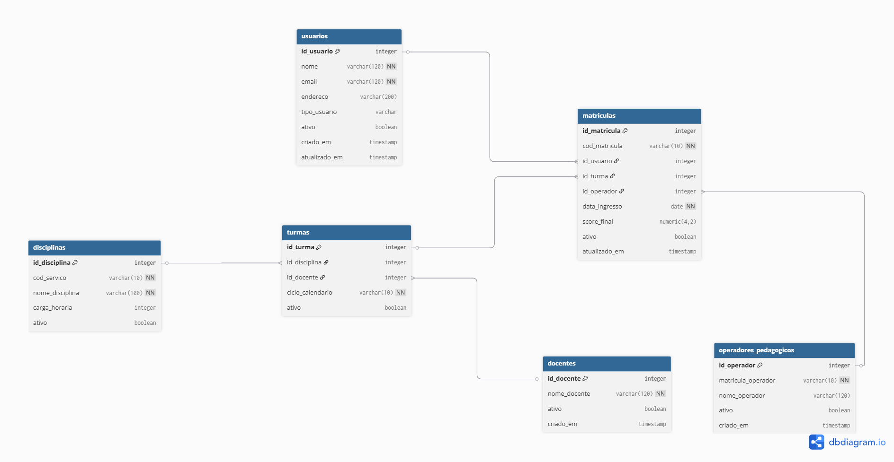

# Respostas

## 1. Modelagem e Arquitetura
 
### 1.1 SGBD Relacional vs. NoSQL
 
**Escolha justificada: PostgreSQL (Relacional)**
 
O cenário acadêmico envolve dados fortemente estruturados (alunos, disciplinas,
matrículas, notas) e relacionamentos bem definidos entre essas entidades. Isso
torna um SGBD Relacional, como o **PostgreSQL**, a escolha mais adequada pelas
razões a seguir:
 
#### Propriedades ACID
As quatro propriedades ACID são críticas neste domínio:

**Atomicidade** Uma transação é "tudo ou nada" Ao matricular um aluno, inserir em `matriculas` e atualizar vagas da turma deve ocorrer como uma unidade; se falhar no meio, nada é persistido .

**Consistência** O banco parte de um estado válido e termina em outro válido Constraints de FK garantem que nunca existirá uma matrícula referenciando uma turma inexistente.

**Isolamento** Transações concorrentes não interferem entre si. Dois secretários alterando a nota do mesmo aluno ao mesmo tempo não corrompem o dado.

**Durabilidade** Uma vez commitada, a transação sobrevive a falhas. Uma nota lançada após a prova não se perde em caso de queda do servidor.
 

 
### 1.2 Uso de Schemas em vez do `public`
 
Em um ambiente profissional de Engenharia de Dados, é recomendado o uso de
**schemas nomeados** (`academico`, `seguranca`) pelas seguintes razões:
 
#### Separação de responsabilidades
Schemas funcionam como "pastas" lógicas dentro do banco. Tabelas de negócio
(`disciplinas`, `turmas`) ficam em `academico`; tabelas de controle de acesso
ficam em `seguranca`. Isso evita o caos de ter 20+ tabelas sem contexto no
`public`.
 
#### Controle de acesso granular (DCL)
Com schemas separados, é possível conceder permissões por namespace:
No esquema `public`, isso seria impossível sem lógica adicional.
 
#### Manutenção e evolução
Ao fazer um `pg_dump` ou migração, é possível exportar apenas o schema
`academico` sem expor dados sensíveis de `seguranca`.
 
#### Documentação implícita
O nome do schema já comunica o domínio da tabela. `academico.matriculas` é
imediatamente mais claro do que apenas `matriculas`.
 
#### Multitenancy futuro
Se o sistema precisar atender múltiplas instituições, adicionar schemas por
tenant (`inst_a.matriculas`, `inst_b.matriculas`) é trivial.
 
---

### 2. Projeto e Normalização
Para atingir a 3NF, a estrutura deve ser separada para evitar redundâncias:

seguranca.perfis: (id, nome_perfil)

seguranca.usuarios: (id, nome, email, id_perfil, ativo) -> 1NF: Atômico / 2NF: Depende da PK / 3NF: Sem transitividade.

academico.professores: (id, id_usuario, titulacao, ativo)
academico.alunos: (id, id_usuario, ra, ativo)

academico.disciplinas: (id, nome, carga_horaria, ativo)

academico.turmas: (id, id_disciplina, id_professor, ciclo, ativo)

academico.matriculas: (id, id_aluno, id_turma, nota, ativo)

### 2.1 Modelo **DER (Diagrama Entidade-Relacionamento)**


### 2.2 Modelo Lógico Detalhado (após normalização)
 
```
schema seguranca
================
usuarios (
    id_usuario           SERIAL          PRIMARY KEY,
    nome                 VARCHAR(120)    NOT NULL,
    email                VARCHAR(120)    NOT NULL UNIQUE,
    endereco             VARCHAR(200),
    tipo_usuario         VARCHAR(20)     NOT NULL DEFAULT 'aluno',
    ativo                BOOLEAN         NOT NULL DEFAULT TRUE
)
 
schema academico
================
docentes (
    id_docente           SERIAL          PRIMARY KEY,
    nome_docente         VARCHAR(120)    NOT NULL,
    ativo                BOOLEAN         NOT NULL DEFAULT TRUE
)
 
operadores_pedagogicos (
    id_operador          SERIAL          PRIMARY KEY,
    matricula_operador   VARCHAR(10)     NOT NULL UNIQUE,
    nome_operador        VARCHAR(120)    NOT NULL,
    ativo                BOOLEAN         NOT NULL DEFAULT TRUE
)
 
disciplinas (
    id_disciplina        SERIAL          PRIMARY KEY,
    cod_servico          VARCHAR(10)     NOT NULL UNIQUE,
    nome_disciplina      VARCHAR(100)    NOT NULL,
    carga_horaria        INTEGER         NOT NULL,
    ativo                BOOLEAN         NOT NULL DEFAULT TRUE
)
 
turmas (
    id_turma             SERIAL          PRIMARY KEY,
    id_disciplina        INTEGER         NOT NULL REFERENCES disciplinas(id_disciplina),
    id_docente           INTEGER         NOT NULL REFERENCES docentes(id_docente),
    ciclo_calendario     VARCHAR(10)     NOT NULL,
    ativo                BOOLEAN         NOT NULL DEFAULT TRUE
)
 
matriculas (
    id_matricula         SERIAL          PRIMARY KEY,
    cod_matricula        VARCHAR(10)     NOT NULL UNIQUE,
    id_usuario           INTEGER         NOT NULL REFERENCES seguranca.usuarios(id_usuario),
    id_turma             INTEGER         NOT NULL REFERENCES turmas(id_turma),
    id_operador          INTEGER         NOT NULL REFERENCES operadores_pedagogicos(id_operador),
    data_ingresso        DATE            NOT NULL,
    score_final          NUMERIC(4,2),
    ativo                BOOLEAN         NOT NULL DEFAULT TRUE
)
```
 
**Relacionamentos:**
- `seguranca.usuarios` 1 — N `academico.matriculas`
- `academico.turmas` 1 — N `academico.matriculas`
- `academico.disciplinas` 1 — N `academico.turmas`
- `academico.docentes` 1 — N `academico.turmas`
- `academico.operadores_pedagogicos` 1 — N `academico.matriculas`
---

### 3. Implementação SQL (DDL, DCL e DML)
[Implementação SQL](../dados/scripts/solucoes.sql)

### 4. Consultas e Relatórios (DML)
[Implementação SQL](../dados/scripts/solucoes.sql)

## 5. Análise de Transações e Concorrência
No cenário proposto, onde dois operadores tentam atualizar o score_final da mesma matrícula simultaneamente, o SGBD (como o PostgreSQL) atua para evitar a corrupção de dados através de dois mecanismos fundamentais:

Isolamento (O "I" do ACID)
O conceito de Isolamento garante que uma transação em andamento não sofra interferência de outra. Mesmo que as operações ocorram no mesmo milissegundo, o SGBD as trata de forma lógica como se fossem sequenciais.

Snapshot: Cada operador inicia sua transação "enxergando" uma versão consistente do dado.

Consistência Final: O isolamento impede o fenômeno da "Atualização Perdida" (Lost Update), garantindo que o banco de dados saia de um estado válido para outro estado válido, sem que o valor final seja uma mistura imprevisível das duas tentativas.

Mecanismo de Locks (Bloqueios)
Para gerenciar esse conflito na prática, o SGBD utiliza Locks de nível de linha (Row-Level Locks):

O Bloqueio: Quando o Operador A executa o comando UPDATE, o SGBD coloca um bloqueio exclusivo naquela linha específica da tabela academico.matriculas.

A Fila de Espera: Quando o Operador B tenta o mesmo UPDATE logo em seguida, o SGBD identifica o lock e coloca a transação do Operador B em estado de espera (WAIT).

A Resolução: * Se o Operador A confirmar a alteração (COMMIT), o lock é liberado e o Operador B processa sua alteração sobre o novo valor gravado por A.

Se o Operador A cancelar a operação (ROLLBACK), o Operador B processa sua alteração sobre o valor original.

Conclusão: Graças à propriedade de Isolamento e ao gerenciamento de Locks, o SGBD evita condições de corrida (race conditions), assegurando que o histórico de notas do sistema SigaEdu permaneça íntegro, independentemente do volume de acessos simultâneos na secretaria.

# Guia de Execução - Sistema SigaEdu

Este projeto foi containerizado com Docker para garantir que o ambiente de banco de dados (PostgreSQL 18) seja idêntico em qualquer máquina, eliminando inconsistências de ambiente e garantindo a portabilidade da solução.

Siga os passos abaixo para subir o sistema e validar a integridade dos dados:

## 1. Pré-requisitos

- Docker Desktop instalado e devidamente configurado.
- Docker Compose ativo e rodando no sistema.

## 2. Subindo o Banco de Dados

Na raiz do projeto (onde se encontra o arquivo `docker-compose.yml`), execute o comando abaixo no terminal para iniciar o container em segundo plano:

```bash
docker-compose up -d
```

## 3. Validação do Script (Smoke Test)

O container está configurado para executar automaticamente o script `solucao.sql` (contendo DDL, DCL e DML) localizado na pasta de scripts durante a inicialização. Para verificar se a criação das tabelas, a aplicação das permissões e a carga de dados ocorreram sem erros, consulte os logs:

```bash
docker logs sigaedu_db
```

**Nota:** Você verá as confirmações de `CREATE TABLE`, `GRANT`, `INSERT` e os resultados das quatro queries de relatório solicitadas no desafio diretamente no log de inicialização.

## 4. Acesso Manual (Opcional)

Caso queira interagir diretamente com o banco ou explorar os schemas `academico` e `seguranca` via linha de comando, utilize o utilitário `psql` dentro do container:

```bash
docker exec -it sigaedu_db psql -U admin -d sigaedu
```

## 5. Encerrando o Ambiente

Para parar o container e remover os volumes persistentes, garantindo que uma futura execução inicie com o banco de dados totalmente limpo, utilize:

```bash
docker-compose down -v
```